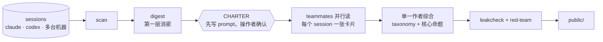

<h1 align="center">distill-my-session</h1>

<p align="center"><em>「轨迹进，词表出。」</em></p>

<p align="center">
  <strong>一套工作方法，本质上是一份词表。</strong><br/>
  把 <a href="https://github.com/justinatusa/vocabulary-first">Vocabulary-First</a> 反过来用在自己的 agent 会话上：从轨迹里抽出有名字的招式，读者再正向拿去用。
</p>

---

## 这是什么

一个 Agent Skill（Claude Code / Codex 通用），读取本机或多台机器上 Claude Code、Codex、Grok Build 的 session 轨迹，产出一份可以公开的学习包。学习包讲的是**怎么做**：

- 操作者的 prompt 和 leading words
- 多个 session 怎样并发，人在什么时候介入、什么时候放手
- harness 怎样把长任务推下去：teammate / subagent、cron / loop、compaction、plan mode

它**不讲做了什么**。公司内部内容和未发表的研究在三层消密之后才会出现在输出里，而且只剩下角色描述。

## 结论前置

| 产出 | 内容 |
|---|---|
| `README.md` | 一句核心命题、3–5 个 threshold concepts、并发架构图 |
| `lexicon.md` | 这套方法的词表：seed terms · 招式（core lexicon）· leading words（shibboleths）· entry vocabulary · concept map |
| `trajectories.md` | 代表性 session 的关键时序 1-2-3，每一步用反事实说明为什么关键 |
| `concurrency.md` / `harness.md` / `prompts.md` | 并发数据与甘特图、harness 用法、可复制的 prompt 模式 |

每个论断都要带证据锚点 `[S03·T12]`。没有证据的内容标成推测，或者删掉。

## 样例

[examples/operator-playbook](examples/operator-playbook/) 是这个 skill 在作者自己 7 天、65 个交互 session 上的真实产出（已消密）。核心结论一句话：

> 目标写进文件，心跳交给 harness，人只做裁决。

| 7 天，65 个交互 session | |
|---|---|
| 同时活跃的 session：峰值 / 均值 | 6 / 1.5 |
| 同时活跃的 agent（含 subagent）：峰值 / 均值 | 15 / 3.7 |
| 人发起的轮次 : harness 发起的轮次 | 417 : 659 |

## 读法

```text
正读，只看人 ──→ 正读，插入每轮 final response ──→ 从结局倒推（上帝视角）
      意图线              一问一答                    关键时序 + 反事实
                                   ↓
                   开放编码 → 轴心编码 → 选择编码（taxonomy 从数据里长出来）
```

中间的工具调用只保留一行骨架。编排类调用（派 teammate、定时、发消息、plan）另外保留，因为它们正是 harness 的智慧所在。

## 流程



## 安装

```bash
git clone https://github.com/chenghaoYang/distill-my-session ~/developer/distill-my-session
ln -s ~/developer/distill-my-session ~/.claude/skills/distill-my-session   # Claude Code
ln -s ~/developer/distill-my-session ~/.agents/skills/distill-my-session   # Codex 等
```

调用：`/distill-my-session 7d`，或者直接说「蒸馏我最近一周的 session」。

## 文档

| | |
|---|---|
| [SKILL.md](SKILL.md) | 协议本体 |
| [examples/operator-playbook](examples/operator-playbook/) | 一份真实产出的样例 |
| [references/lens.md](references/lens.md) | Vocabulary-First 反向使用时，各个术语分别对应什么 |
| [references/method.md](references/method.md) | 三遍读法、倒推、反事实、反拼贴规则 |
| [references/declassify.md](references/declassify.md) | 消密：保留形状，去掉实质 |
| [references/output-schema.md](references/output-schema.md) | 卡片与公开包的固定字段 |
| [references/team.md](references/team.md) | reader 与 red-team 的派活 prompt |
| [scripts/distill.py](scripts/distill.py) | 确定性的一半：scan · digest · timeline · suggest · leakcheck（只用标准库） |
| [scripts/sources.py](scripts/sources.py) · [scripts/redact.py](scripts/redact.py) | 三种轨迹格式的解析；第一层消密与 leakcheck |

## 许可

[MIT](LICENSE)。读法借用了 [Vocabulary-First](https://github.com/justinatusa/vocabulary-first)（MIT）。

---

<p align="center">
  <sub>先给招式起名，再谈学会。</sub><br/>
  <sub><em>Name the moves first. Then they can be learned.</em></sub>
</p>
