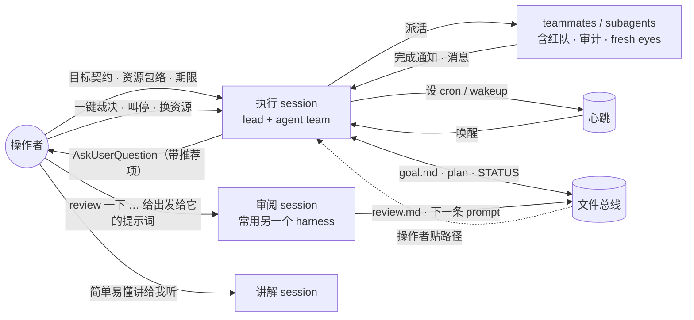

<h1 align="center">一位操作者的 agent 工作法</h1>

<em>「目标写进文件，心跳交给 harness，人只做裁决。」</em>

  从 7 天、65 个交互 session 里反向蒸馏出来的方法词表。 
  只讲怎么做，不讲做了什么。

---

## 结论前置

操作者同时开着 6 个 session、15 个 agent 的时候，并没有逐个盯着看。

| 7 天，65 个交互 session | |
|---|---|
| 同时活跃的 session：峰值 / 活跃时均值 | 6 / 1.5 |
| 同时活跃的 agent（含 subagent）：峰值 / 均值 | 15 / 3.7 |
| 人发起的轮次 : harness 发起的轮次 | 417 : 659 |
| 一条 prompt 之后 agent 自己跑下去的最长时间：各 session 中位数 / 最长 | 1.4 小时 / 29 小时 |
| agent 忙时插话 / 人工打断（两个独立计数，数值恰好相同） | 59 / 59 |

会话活跃均值约为 1.5，agent 活跃均值约为 3.7；这不是人的注意力或照看上限。推动 agent 的轮次，一大半不是人发起的 [timeline]。

五个门槛概念：

1. **目标写进文件，不留在对话里。** 目标、资源、裁决都成文，每个派活 prompt 都以「先读它」开头 [S32·T1→T2] [S65·T4] [S61·T5]。cron 的 prompt 里也写目标 [S63·T6]。
2. **用闸门代替审阅。** 会话记录里没有操作者读代码、读数据、核数字的痕迹；替人读的是只读审计、红队、负对照、fresh-eyes reviewer 和跨家族盲评 [S65·T6.1] [S32·T9.14] [S32·T11.3] [S50·T6]。
3. **先设心跳，再干活。** 没有心跳的夜晚都白费了 [S63·T1] [S50·T14]；有心跳的夜晚跑了 9 小时 [S32·T9] [S61·T5]。
4. **并发的是角色，总线是文件。** 同一个项目里，执行、审阅、讲解分给不同 session，甚至不同 harness，靠 goal.md、review.md、调用指南交接 [S32 hindsight] [S61·T13→S65·T4]。
5. **人的话要短，说在拐点上。** 止损换资源、叫停、给准名字、定停止条件，每句都不长，却改了后面的轨迹 [S28·T24→T26] [S50·T2] [S65·T2] [S28·T33]。

## 并发架构

## 一个例子：一段夜里无人值守的训练（S63）

1. 第一轮还没设 cron，就撞上 rate limit 停了，空转近 7 小时 [S63·T1]。
2. 操作者问一句「如何了」。agent 先建每小时的 cron，再诊断，再用 AskUserQuestion 请操作者一键决定「停训、改 recipe 重起」[S63·T2]。
3. 操作者说「反正确保训练好」。agent 把 cron 的第一句改成 “Goal: ensure training is GOOD, not just alive.”，下一次巡检就如实报告问题没解决 [S63·T6]。
4. 第二次一键授权后，agent 把「某个 checkpoint 写完就停旧 run、起新 run、记账、验证」写成条件 cron。夜里没人，它照样执行了 [S63·T6.4]。

没有第 3 步，cron 会一直报「健康」；没有第 4 步，换 run 要等下一条人类 prompt，而这个 session 里人类 prompt 之间常隔好几个小时。

## 文档

| | |
|---|---|
| [lexicon.md](lexicon.md) | 方法词表：seed terms、招式、leading words、entry vocabulary、概念图 |
| [trajectories.md](trajectories.md) | 6 个代表性 session 的关键时序和反事实 |
| [concurrency.md](concurrency.md) | 并发数据、热力条、跨 session 的问答 |
| [harness.md](harness.md) | 每种 harness 机制什么时候用、救了什么、在哪里失效 |
| [prompts.md](prompts.md) | 可复制的 prompt 模式，含 lead 写给 teammate 的派活骨架 |
| [method.md](method.md) | 这份材料怎么做出来的，局限在哪 |

锚点 `[S32·T4]` 指第 32 个 session 的第 4 条人类 prompt；`T4.2` 是它之后 harness 发起的第 2 个轮次；`[timeline]` 指并发统计。

---

  写下目标，交出心跳，留住裁决。 
  <em>Write the goal down. Hand off the heartbeat. Keep the verdict.</em>

