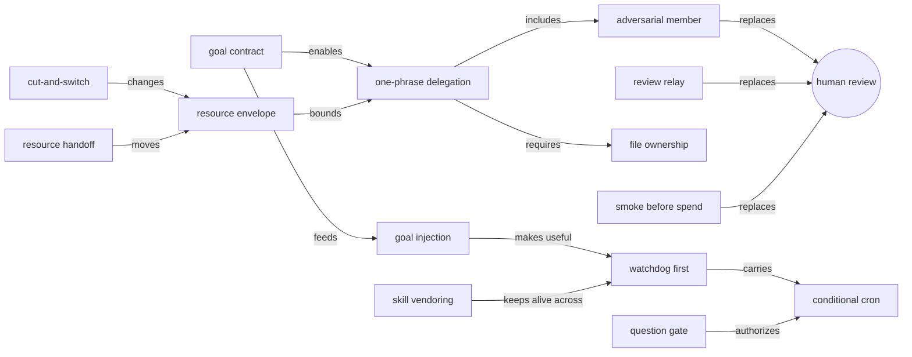

# 方法词表（Vocabulary-First，反向蒸馏）

一套工作法能被学会，前提是它的招式有名字。下面的词都从轨迹里归纳出来，每个都带证据锚点和反事实。读者正向使用时，把这些词当作写 prompt 的语义约定。

## Seed terms（入口词）

目标契约 · 资源包络 · 一句话派活 · 唱反调的成员 · 闸门 · 一键裁决 · 心跳 · 条件 cron · 角色 session · 文件总线 · 止损换资源 · 回流成 skill

## Core lexicon（招式）

### A. 目标外置

| term | aliases | definition | anchors | counterfactual | copyable form |
|---|---|---|---|---|---|
| **goal read-back** 目标复述探针 | 你先说目的 | 开工前先让 agent 复述项目目标，错了当场纠正 | S32·T1→T2；S52·T1 | 被否定的那版复述会成为默认口径 | 「对齐一下最新进度，然后你先说这个项目的目的是什么？」 |
| **goal contract** 目标契约成文 | goal.md、plan 契约、运行约定 | 目标、约束、裁决写进仓库文件；每个派活 prompt 以「先读它」开头 | S32·T2；S65·T4；S61·T5；S61·T9 | 目标只能从几十万 token 的对话里重建，compaction 之后漂移 | 「写到 md，防止之后偏移目标」 |
| **goal injection** 目标写进心跳 | cron 首句的 Goal | cron 或 heartbeat 的 prompt 第一句写目标和验收信号，不只检查进程还活着 | S63·T6；S61·T4.1 | 监控一直报「健康」，指标却在变坏 | “Goal: ensure X is GOOD, not just alive.” |
| **numbered amendment** 编号修订 | A<n> | 计划变更和冲突的裁决写成编号条目 | S65·T5.1；S65·T6.16 | compaction 之后找不到某个决定的来由 | 「冲突写成 plan 里的 amendment A<n>，注明动机」 |
| **pre-registration** 先登记再看数据 | 预声明验收信号 | 改动的动机、预测和通过标准，在数据出来之前写下 | S65·T6.16；S63·T4；S32·T3.8 | 事后挑有利的指标讲故事 | 「先登记预测和 pass/fail 标准，再跑」 |

### B. 派活

| term | aliases | definition | anchors | counterfactual | copyable form |
|---|---|---|---|---|---|
| **one-phrase delegation** 一句话派活 | agent team完成、多agent完成 | 人只给结果和一句口令，lead 把它展开成结构化的派活 prompt | S28·T1；S32·T3；S65·T4 | 人要亲手写每个 teammate 的 prompt | 「……agent team 完成」 |
| **resource envelope** 资源包络 | 可用 GPU、并发、时段 | 只规定能用什么、不能碰什么，做法留给 agent | S32·T3；S65·T4；S61·T5 | agent 占用别人的资源，或者不敢用 | 「<A> 只能推理、不可换模型；<B> 随便用；并发 <N>」 |
| **file ownership** 按文件分工 | Only edit your files | 并行实现者各管自己的文件，跨文件的问题由 lead 转发 | S32·T3.1；S32·T3.3；S65·T4 | 几个 agent 在同一工作树里互相覆盖 | “Only create/edit the files assigned to you; ship your interfaces first.” |
| **adversarial member** 唱反调的成员 | 红队、novelty-checker、只读审计、fresh eyes | 每个团队至少一个只读成员，专门找错 | S32·T3.1；S65·T2；S65·T6.1；S32·T11.4 | 数据泄漏、公平性缺陷、归因错误进入结论 | “try HARD to show that it is NOT novel” |
| **model routing** 按角色选模型 | subagent 用 X | prompt 里指定子代理的模型；lead 和 worker 可以不同 | S32·T2；S61·T2；S50·T1 | — | 「subagent 选择 opus」 |
| **role split** 部署的不评测 | 分工 | 同一条流水线上，产出者和评判者分开 | S28·T1 | 自己给自己打分 | 「不要跑评测，那是下一个 agent 的活」 |

### C. 闸门

| term | aliases | definition | anchors | counterfactual | copyable form |
|---|---|---|---|---|---|
| **smoke before spend** 先 smoke 再花钱 | smoke 门、首批复核再放量 | 大规模运行前先过一次小规模真实运行 | S65·T4；S61·T2；S61·T4 | 错误到全量时才暴露 | 「smoke 验证流程合理，再放量」 |
| **negative control** 负对照 | 校准臂 | 放一条不该赢的对照臂；它也「显著」，说明尺子坏了 | S32·T9.14 | 失准的检验把噪声报成结果 | 「加一条不该赢的对照臂」 |
| **question gate** 一键裁决 | AskUserQuestion + Recommended | 不可逆的决定由 agent 发问并给出推荐项，人点一下 | S63·T2；S63·T6.4；S65·T4；S50·T5 | agent 要么擅自动手，要么干等 | 「这一步不可逆，给我选项和推荐」 |
| **review relay** 跨 session 审阅回灌 | review.md | 另一个 session（常是另一个 harness）审执行 session，操作者把 review 路径贴回去 | S32·T4；S32·T7；S38·T3；S21·T5 | 单测全绿时，契约级缺陷照样漏过 | 「新的 review：<path>。你觉得正确吗？需要修改吗？」 |
| **number-checked build** 数字断言 | — | 交付物里每个数字都由脚本对照数据源断言 | S32·T11.3 | 交付物里出现对不上的数字 | 「每次构建都校验上屏数字」 |
| **explain-back** 讲给我听 | 中文讲解 | 操作者不读报告，要 agent 讲结论、机制和局限 | S50·T7 | 结果没人消费，也没人发现局限 | 「中文讲解一下这个 bench 的结论」 |
| **reality audit** 现实对账 | — | 交付前问一个具体问题，让 agent 对照实际情况自查 | S32·T14 | 没测过的闭环被当成结论讲出去 | 「你看我们的交付物里现在写的啥」 |
| **value gate** 价值闸门 | — | 利用率不能用没有价值的负载去凑 | S61·T11→T12 | 算力被重复请求占满 | 「我的意思是真实任务一直跑就行」 |

### D. 心跳

| term | aliases | definition | anchors | counterfactual | copyable form |
|---|---|---|---|---|---|
| **watchdog first** 先设看门狗 | cron、ScheduleWakeup、heartbeat | 长任务的第一步是设心跳；心跳的 prompt 自带命令、路径、验收信号 | S63·T2；S61·T4 | 第一次报错就停，空转数小时 | 「先建一个每小时的监控 cron，再开始」 |
| **conditional cron** 条件 cron | 预授权的延迟执行 | 人授权一次，agent 把「满足条件就执行」写进 cron | S63·T6.4 | 动作要等下一条人类 prompt | 「到 X 时停掉旧 run、起新 run、记账、验证」 |
| **re-arm** 重启后上弦 | — | 进程重启会杀掉自唤醒链，需要人或 hook 重新启动 | S32·T9 | session 静默一整天 | 「继续完整迭代好。」 |
| **cadence tuning** 调节巡检频率 | 4h 一次 | 心跳太密是噪声，太疏会漏掉停摆 | S61·T5；S61·T7 | 10 分钟一次的空转唤醒，或 4 小时才发现停摆 | 「4h 一次吧，每次把任务安排好就行」 |
| **human heartbeat** 人当心跳（反模式） | 如何了、继续 | 没有 cron 时，人在 session 之间轮询 | S28·T14–T18 | — | 用 watchdog first 替代 |

### E. 资源

| term | aliases | definition | anchors | counterfactual | copyable form |
|---|---|---|---|---|---|
| **cut-and-switch** 止损换资源 | 算了，换 | 一句话放弃卡住的路径，下一句给出更好的资源和口令 | S28·T24→T26 | 5 个候选只测完 2 个 | 「算了，本地不要测了，只留结果」＋「ssh …，4 卡，agent team 完成」 |
| **utilization rule** 卡不能停 | 拉满、见缝插针 | 以算力利用率为约束，逼出并行排程 | S28·T27；S61·T11 | 串行排队，卡空着 | 「下载的同时就测评，卡不能停」 |
| **resource handoff** 资源让渡 | 跑完就停 | 一个 session 收尾、写调用指南，把服务让给另一个 | S61·T13→T18；S65·T4 | 两个 session 争用同一服务 | 「跑完就可以停，我让别的任务用」 |

### F. 人的短句

| term | aliases | definition | anchors | counterfactual | copyable form |
|---|---|---|---|---|---|
| **brake and restate** 叫停并重述 | overthinking了？ | 用反问叫停过度扩展，再用一句话给出正确的对比轴 | S50·T2 | 6 个子代理做了无关的调研 | 「先不管啊。我们对比的是 A 和 B」 |
| **stop rule** 停止条件 | 测好就不管 | 说清楚哪些做完就停 | S28·T33；S61·T18 | lead 一直追长尾 | 「测这两个就行，测好就不管其他的」 |
| **time horizon** 期限代替步骤 | 跑到明天早上、至少 48h | 用时间边界代替步骤清单 | S65·T6；S50·T10 | — | 「持续推进至少到 48h」 |
| **term repair** 一词纠错 | — | 语音输入把术语转错时，只补发一个正确的词 | S65·T2；S61·T14 | 整个调研偏到邻近领域 | 「<正确术语>」 |
| **result-only closure** 只要结果 | 给我看看结果 | 拒绝过程汇报，只要结果表，再定下一步 | S28·T31→T32 | 汇报淹没在过程里 | 「给我看看结果就行」 |

### G. 回流

| term | aliases | definition | anchors | counterfactual | copyable form |
|---|---|---|---|---|---|
| **skill vendoring** 技能入库 | 防止我一个一个说 | 把用到的技能复制进项目，在 AGENTS.md 登记索引 | S61·T3 | 夜里的唤醒拿不到规则 | 「防止到时候我一个一个要说一次」 |
| **codify the run** 沉淀成 skill | — | 一段跑通的操作写成 skill，下次任何 agent 都能照做 | S05·T2；S11·T3；S40·T2 | 同样的坑再踩一遍 | 「把这个流程完整收敛为一个 skill」 |

## Shibboleths（leading words）

这些是操作者 prompt 里反复出现、并且确实改变了 agent 行为的原话。

| 原话 | 什么时候说 | 引发了什么 | anchors |
|---|---|---|---|
| 「agent team 完成」「多 agent 完成」 | 几乎每次派活 | lead 自己选机制：22 个后台 subagent、12 个 teammate、一个 cron，或 Codex 的 spawn_agent | S32·T3；S28·T1；S63·T1；S61·T2 |
| 「完整」 | 大多数 prompt | 要求做完，不停在半成品 | S32 intent line |
| 「你先说…目的是什么」 | 新 session 开场 | 复述探针，误解在开工前暴露 | S32·T1 |
| 「还是那句话」 | 重申常设规则 | lead 把规则写进 brief，compaction 后仍保留 | S28·T9 |
| 「如何了」「继续」 | agent 停下后 | 重启被 API 错误打断的轮次 | S28·T14–T18；S63·T2 |
| 「卡不能停」「拉满」「见缝插针」 | 算力空闲时 | 叠放服务、按空卡排队 | S28·T27；S28·T28 |
| 「算了」 | 路径卡死时 | 全部停止或删除，下一句一定跟着改向 | S28·T12；S28·T24；S28·T38 |
| 「给我看看结果就行」 | 不想看过程时 | 只给结果表 | S28·T32 |
| 「反正确保 X 好」 | 监控只报「活着」时 | 目标从活着升级为有效 | S63·T6 |
| 「不要把 A 当作 B 已正确」 | 审阅 session 写好、操作者 6 分钟后贴给执行 session | 防 over-claim | S21·T5→S15·T16 |
| 「这一轮不要扩…、不要加…、不要换…」 | 修问题的一轮 | 范围围栏 | S22·T13 |
| 「发散，不要固定于我的代码和思路」 | 交出自己的计划时 | 允许 agent 偏离原实现 | S65·T5 |
| 「subagent 用 opus」 | 派活时 | 指定子代理模型 | S32·T2；S61·T2 |
| 「写到 md」「记录到 md 防止忘记」 | 加约束时 | 约束成文，跨 compaction 保留 | S32·T5；S61·T5 |
| 「你仔细指挥好」 | 放量前 | agent 以调度者身份行事，并自建心跳 | S61·T4 |

## Semantic anchors（被点名的方法）

- 操作者点名的：agent team、review、smoke、benchmark、gap、baseline、「不公平的对比」、一个开源的 autoresearch 循环（一句话展开成完整的迭代协议）[S50·T10]。
- lead 自己引入的：red team、pre-registration、negative control、fresh eyes、A/A 校准、contract-first shim。这些名字一出现，后面的做法就跟着对齐。

## Trigger terms（让 harness 动起来的词）

| 词 | 机制 |
|---|---|
| 「定时监控」「4h 一次」 | cron、Codex automation heartbeat |
| agent team | Agent / teammates / spawn_agent |
| `/compact` 紧跟着新阶段指令 | 手动 compaction 之后再开新阶段 |
| `/goal 持续推进至少到 48h` | stop hook，定期 check-in |
| `/model` 换阶段 | 研究阶段和交付阶段用不同的 lead 模型 |

## Entry vocabulary（外行说法 → 标准名）

| 外行说法 | preferred term |
|---|---|
| review 不过来 | review bottleneck → gates + review relay |
| agent 跑一半就停了 | early stop → watchdog first、re-arm |
| 它把目标搞错了 | goal drift → goal read-back + goal contract |
| cron 说一切正常，结果是坏的 | liveness-only monitoring → goal injection |
| 几个 agent 互相覆盖 | write contention → file ownership + lead 转发 |
| 它想得太多了 | over-scope → brake and restate |
| 卡空着 | idle compute → utilization rule + value gate |
| 每次都要重复讲规则 | no flow-back → skill vendoring、brief 文件 |
| 结果不敢信 | unverified claim → negative control、盲评、数字断言 |

## Concept map

